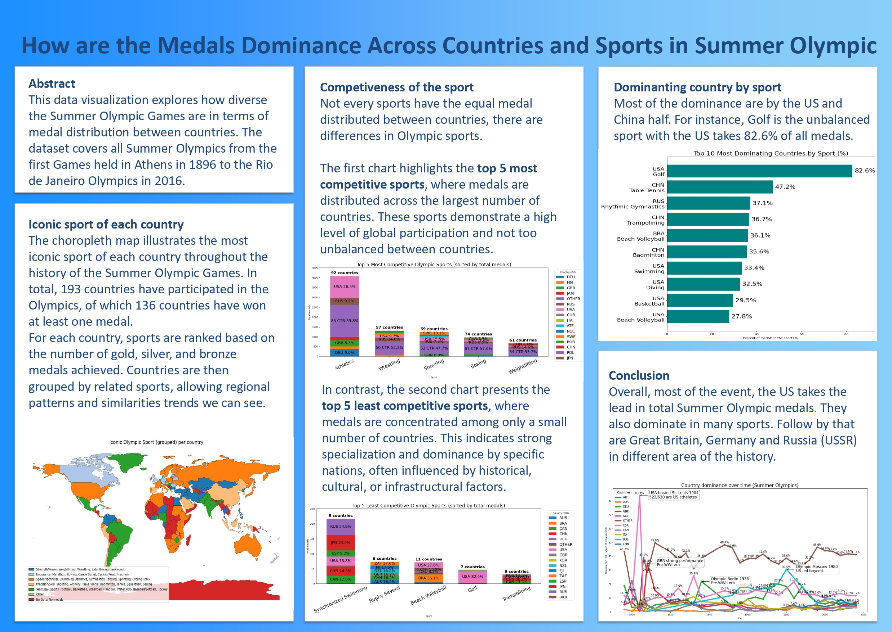

# How are the Medals Dominance Across Countries and Sports in Summer Olympic

## Visualization (Pano)

## Introduction
This project explores how major countries dominate the Summer Olympic Games, both overall and within individual sports.
Using historical Olympic data from 1896 to 2016, the analysis answers:
- Which countries dominate the Olympics over time?
- Which sports are the most competitive?
- Which sports are dominated by only a few nations?

## Data Processing
The analysis process includes:
- Cleaning and preprocessing historical Olympic datasets and countries with NOC codes dataset 
- Aggregating medal counts by country and sport
- Identifying dominant countries and competitive sports
- Visualizing patterns using charts and maps, using pre-attempt of 110cultural folders

## Key Insights
- The United States leads in total medal count and dominates many sports
- Some sports are highly competitive with medals distributed across many countries
- Others are heavily dominated by a few nations (e.g., Golf by the US)
- Regional patterns can be observed in “iconic sports” by country

## Technologies Used
- **Data Analysis and Visualization**: Python (Jupyter Notebook, pandas, numpy, geopandas, matplotlib, seaborn)
- **Design**: PowerPoint, Canva
